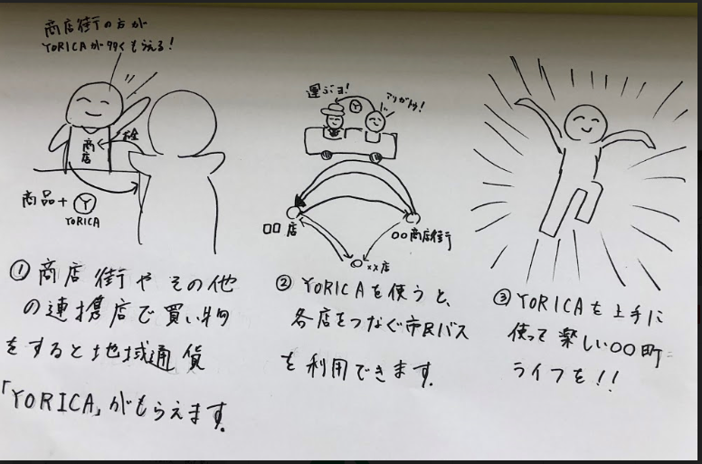

<table>
<tr>
  <td><a href = "index.html">トップ</a> </td>
  <td><a href = ".html">YORICA利用方法</a> </td>
  <td><a href = "https://16-2505-020-7.github.io/YORICA/TimeTable.html">YORICA利用可能エリア</a> </td>
  <td><a href = "https://kodai1221.github.io/employment/index.html">運転手雇用について</a> </td>
  <td><a href = "https://16-2505-0468.github.io/w046ff/dandai.html">実績紹介</a> </td> 
</tr>
<tr>
  <td><a href = "https://16-2505-0468.github.io/w046ff/toiawase.html">問合わせ</a> </td>
</tr>
</table> 
# YORICAとは、 

 

YORICAとは、 ○○町商店街を中心に あなたと○○町をつなぐ 地域通貨です

# YORICAでできること
     
# 商店街のお店

 
 
 
 

# そのほかの連携店

  
  
  
  

<a href = "./">ページの上へ</a>

